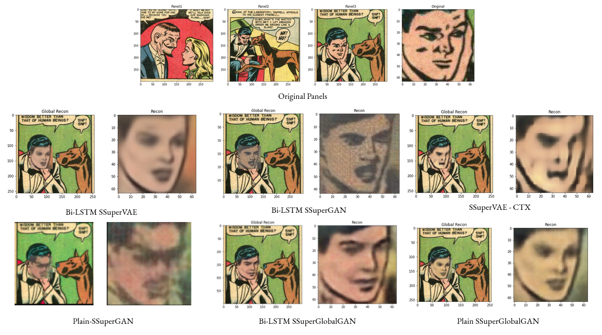
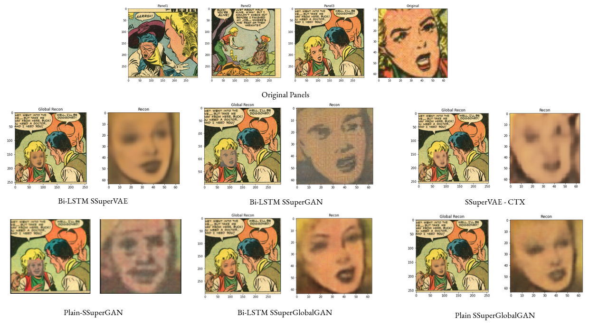

# Self-Supervised Face Generation using Panel Context Information (SSuperGAN)

This model tries to generate masked faces of the characters given the previous sequential frames. 

## Notes:

This repository is not fully completed!

## Datasets:

- [**Golden Age Comics**](https://digitalcomicmuseum.com/): Includes US comics between 1938 to 1956. The extracted panel images are used, which are retrieved through the study [The Amazing Mysteries of the Gutter](https://arxiv.org/abs/1611.05118).

The whole panel data is processed by a cartoon Face Detector model (which can be found in [here](https://github.com/barisbatuhan/FaceDetector)) by using `mixed_r50` weights and by setting `confidence threshold` to 0.9 and `nms threshold` to 0.2. The following statistics are retrieved from the data:

- **Total files:** 1229664
- **Panel Height:** mean=510.0328 / median=475 / mode=445
- **Panel Width:** mean=508.4944 / median=460 / mode=460

## Model Architecture


## Results

### Visual Results





### Metric Results


## Pretrained Models and Links

- Face detection (Siamese) on iCartoonDataface (~%86 test acc) [link](https://drive.google.com/file/d/1ey896AyT-uqQ5YlHSp4880da40-Ju1pS/view?usp=sharing)
- [Google Sheet](https://docs.google.com/spreadsheets/d/1JPdPtDocE8LMN4v246cLKqqJB9qZQNbMOtdg1fHy8AI/edit?usp=sharing) for recording Experiment Results

## Modules

### USING GOLDEN AGE DATA

- In order to run the module 'golden_age_config.yaml' file should be created under configs.

```yaml
# For directly face generation task
faces_path: /userfiles/comics_grp/golden_age/golden_faces_no_margin/
face_train_test_ratio: 0.9

# For panel face reconstruction task
panel_path: /datasets/COMICS/raw_panel_images/
sequence_path: /userfiles/comics_grp/golden_age/seq_panels_faces_conf_90.json
annot_path: /userfiles/comics_grp/golden_age/golden_face_annot/
only_panels_annotation: /userfiles/comics_grp/golden_age/only_panel_data.json
mask_val: 1
mask_all: False
return_mask: True
return_mask_coordinates: True
train_test_ratio: 0.95
train_mode: True
```

### Parameters of a Sample Model Module

- In order to run a model, a subset of the hyper-parameters below has to be set depending on the model type. Add the file to `configs` directory and set correct paths in the `utils/config_utils.py`.

```yaml
# Encoder Parameters
backbone: "efficientnet-b5"
embed_dim: 1024
latent_dim: 512
use_lstm: True

# Plain Encoder Parameters
seq_size: 3

# LSTM Encoder Parameters
lstm_conv: False
lstm_hidden: 1024
lstm_bidirectional: True

# These do not change depending on Conv-LSTM
lstm_dropout: 0
fc_hidden_dims: []
fc_dropout: 0
num_lstm_layers: 1
masked_first: True

# DCGAN Parameters
img_size: 64
panel_size:
    - 300
    - 300
gen_channels: 64
enc_channels: 
    - 64
    - 128
    - 256
    - 512
local_disc_channels: 64
global_disc_channels: 64

# batch, instance, layer are valid options to choose
gen_norm: "batch"
enc_norm: "batch"
disc_norm: "batch"

# Training Parameters
batch_size: 32
train_epochs: 200
lr: 0.0002
weight_decay: 0.000025
beta_1: 0.5
beta_2: 0.999
g_clip: 100

local_disc_lr: 0.0002
global_disc_lr: 0.005
disc_mom: 0.9

# Parallelization Parameters
parallel: True
```

### Project Based Configuration

One should check and update 'configs/base_config' for global config parameters such base project directory.
