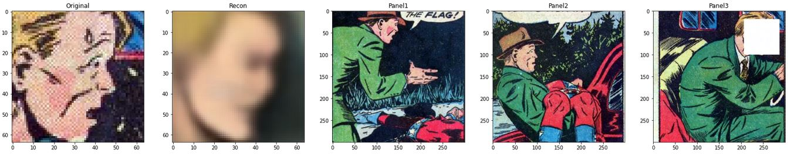

# Self-Supervised Face Generation using Panel Context Information (SSuperGAN)

This model tries to generate masked faces of the characters given the previous sequential frames. 

## Notes:

This repository is not fully completed!

## Datasets:

- [**Golden Age Comics**](https://digitalcomicmuseum.com/): Includes US comics between 1938 to 1956. The extracted panel images are used, which are retrieved through the study [The Amazing Mysteries of the Gutter](https://arxiv.org/abs/1611.05118).

The whole panel data is processed by a cartoon Face Detector model (which can be found in [here](https://github.com/barisbatuhan/FaceDetector)) by using `mixed_r50` weights and by setting `confidence threshold` to 0.55 and `nms threshold` to 0.2. The following statistics are retrieved from the outputs of the detector model.

- ** Total files:** 1229664
- **Total files with found faces:** 684885
- **Total faces:** 1063804
- **Faces above 64px:** 309079 / 521089 `(min(width, height) >= 64 / max(width, height) >= 64)`
- **Faces above 128px:** 75111 / 158988 `(min(width, height) >= 128 / max(width, height) >= 128)`
- **Faces above 256px:** 13214 / 27471 `(min(width, height) >= 256 / max(width, height) >= 256)`
- **Panel Height:** mean=510.0328 / median=475 / mode=445
- **Panel Width:** mean=508.4944 / median=460 / mode=460

## Model Architecture


## Results

### Visual Results




### Metric Results


## Pretrained Models and Links

- Face detection (Siamese) on iCartoonDataface (~%86 test acc) [link](https://drive.google.com/file/d/1ey896AyT-uqQ5YlHSp4880da40-Ju1pS/view?usp=sharing)
- [Google Sheet](https://docs.google.com/spreadsheets/d/1JPdPtDocE8LMN4v246cLKqqJB9qZQNbMOtdg1fHy8AI/edit?usp=sharing) for recording Experiment Results

## Modules

### USING GOLDEN AGE DATA
- In order to run the module 'golden_age_config.yaml' file should be created under configs.
- Example Config:

```yaml
# For directly face generation task
faces_path: /userfiles/comics_grp/golden_age/faces_128/
face_train_test_ratio: 0.9

# For panel face reconstruction task
panel_path: /datasets/COMICS/raw_panel_images/
sequence_path: /userfiles/comics_grp/golden_age/panel_face_areas.json
annot_path: /userfiles/comics_grp/golden_age/face_annots/
mask_val: 1
mask_all: False
return_mask: False
train_test_ratio: 0.95
train_mode: True
panel_dim: 
    - 300
    - 300
```


### USING PLAIN SSUPERVAE MODULE

- To train the PlainSSuperVAE network, you have to specify the following parameters in the `ssupervae_config.yaml` file under the *configs* folder. To use the LSTM structure, simply set the flag `use_lstm` to `True`.

```yaml
# Encoder Parameters
backbone: "efficientnet-b5"
embed_dim: 256
latent_dim: 256 
use_lstm: False

# Plain Encoder Parameters
seq_size: 3

# LSTM Encoder Parameters
lstm_hidden: 256
lstm_dropout: 0
fc_hidden_dims: []
fc_dropout: 0
num_lstm_layers: 1
masked_first: True

# Decoder Parameters
decoder_channels:
    - 64
    - 128
    - 256
    - 512
image_dim: 64

# Training Parameters
batch_size: 4
train_epochs: 100
lr: 0.0002
weight_decay: 0.000025
beta_1: 0.5
beta_2: 0.999
g_clip: 100
```

### VAE MODULE
- In order to run the module 'vae_config.yaml' file should be created under configs.
- Example Config:
```yaml
num_training_samples: 30000
num_test_samples: 10240
test_samples_range:
    - 10240
    - 10640
image_dim: 64
batch_size: 64
train_epochs: 100
lr: 0.0002
weight_decay: 0.000025
beta_1: 0.5
beta_2: 0.999
latent_dim_z: 256
g_clip: 100
channels:
    - 64
    - 128
    - 256
    - 512
```
### INTRO VAE MODULE
- In order to run the module 'intro_vae_config.yaml' file should be created under configs.
- Example Config:
```yaml
face_image_folder_train_path: /home/gsoykan20/Desktop/ffhq_thumbnails/thumbnails128x128/
face_image_folder_test_path: /home/gsoykan20/Desktop/ffhq_thumbnails/thumbnails128x128/
num_training_samples: 100
test_samples_range:
    - 10240
    - 10640
image_dim: 64
batch_size: 32
train_epochs: 200
lr: 0.0002
weight_decay: 0.000025
beta_1: 0.5
beta_2: 0.999
latent_dim_z: 256
g_clip: 100
channels:
    - 64
    - 128
    - 256
    - 512

# Check paper for the meaning of this params https://arxiv.org/abs/1807.06358
adversarial_alpha: 0.25
ae_beta: 5
adversarial_margin: 110
```


### DCGAN MODULE
- In order to run the module 'dcgan_config.yaml' file should be created under configs.
- Example Config:
```yaml
# For directly face generation task
dataroot : "data/celeba"
# Number of workers for dataloader
workers : 4

# Batch size during training
batch_size : 128

# Spatial size of training images. All images will be resized to this
#   size using a transformer.
image_size : 64

# Number of channels in the training images. For color images this is 3
nc : 3

# Size of z latent vector (i.e. size of generator input)
nz : 100

# Size of feature maps in generator
ngf : 64

# Size of feature maps in discriminator
ndf : 64

# Number of training epochs
num_epochs : 150

# Learning rate for optimizers
lr : 0.0002

# Beta1 hyperparam for Adam optimizers
beta1 : 0.5

# Number of GPUs available. Use 0 for CPU mode.
ngpu : 1

# Dataset path
#dataset_path : "/userfiles/ckoksal20/img_align_dataset"
dataset_path : "/kuacc/users/ckoksal20/img_align_dataset"
```


### SSuper_DCGAN MODULE
- In order to run the module 'ssuper_dcgan_config.yaml' file should be created under configs.
- Example Config:
```yaml
# Encoder Parameters
backbone: "efficientnet-b5"
embed_dim: 1024
latent_dim: 512
use_lstm: True

# Plain Encoder Parameters
seq_size: 3

# LSTM Encoder Parameters
lstm_hidden: 1024
lstm_bidirectional: True
lstm_dropout: 0
fc_hidden_dims: []
fc_dropout: 0
num_lstm_layers: 1
masked_first: True

# DCGAN Parameters
img_size: 64
gen_channels: 64
local_disc_channels: 64

# Training Parameters
batch_size: 24
train_epochs: 200
lr: 0.0002
weight_decay: 0.000025
beta_1: 0.5
beta_2: 0.999
g_clip: 100

# Parallelization Parameters
parallel: True
```

### Project Based Configuration

One should check and update 'configs/base_config' for global config parameters such base project directory.
