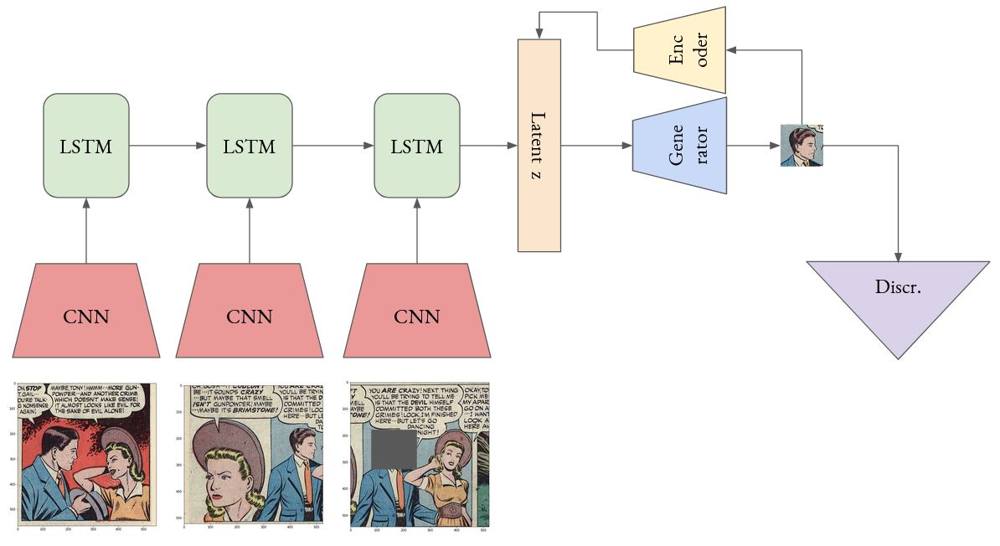

# Self-Supervised Face Generation using Panel Context Information (SSuperGAN)

This model tries to generate masked faces of the characters given the previous sequential frames. 

## Notes:

This repository is not fully completed!

## Datasets:

- [**Golden Age Comics**](https://digitalcomicmuseum.com/): Includes US comics between 1938 to 1956. The extracted panel images are used, which are retrieved through the study [The Amazing Mysteries of the Gutter](https://arxiv.org/abs/1611.05118).

The whole panel data is processed by a cartoon Face Detector model (which can be found in [here](https://github.com/barisbatuhan/FaceDetector)) by using `mixed_r50` weights and by setting `confidence threshold` to 0.55 and `nms threshold` to 0.2. The following statistics are retrieved from the outputs of the detector model.

- **Total files:** 684885
- **Total faces:** 1063804
- **Faces above 64px:** 309079 / 521089 `(min(width, height) >= 64 / max(width, height) >= 64)`
- **Faces above 128px:** 75111 / 158988 `(min(width, height) >= 128 / max(width, height) >= 128)`
- **Faces above 256px:** 13214 / 27471 `(min(width, height) >= 256 / max(width, height) >= 256)`
- **Mean of Panel Height:** 510.0328, Median of Height: 475, Mode of Height: 445, Num Samples: 1229664
- **Mean of Panel Widths:** 508.4944, Median of Height: 460, Mode of Height: 460, Num Samples: 1229664 

## Model Architecture



## Results


## Pretrained Models and Links

- Face detection (Siamese) on iCartoonDataface (~%86 test acc) [link](https://drive.google.com/file/d/1ey896AyT-uqQ5YlHSp4880da40-Ju1pS/view?usp=sharing)
- [Google Sheet](https://docs.google.com/spreadsheets/d/1JPdPtDocE8LMN4v246cLKqqJB9qZQNbMOtdg1fHy8AI/edit?usp=sharing) for recording Experiment Results

## Modules

### USING GOLDEN AGE DATA
- In order to run the module 'golden_age_config.yaml' file should be created under configs.
- Example Config:

```yaml
panel_path: /datasets/COMICS/raw_panel_images/
sequence_path: /userfiles/comics_grp/golden_age/panel_face_areas.json
annot_path: /userfiles/comics_grp/golden_age/face_annots/
faces_path: /userfiles/comics_grp/golden_age/faces_128/
face_confidence: 0.9
panel_dim: 
    - 300
    - 300
```


### USING PLAIN SSUPERVAE MODULE

- To train the PlainSSuperVAE network, you have to specify the following parameters in the `plain_ssupervae_config.yaml` file under the *configs* folder.

```yaml
# Encoder Parameters
backbone: "efficientnet-b5"
seq_size: 3
embed_dim: 256

# Decoder Parameters
latent_dim: 256 
decoder_channels:
    - 64
    - 128
    - 256
    - 512
image_dim: 64

# Training Parameters
batch_size: 8
train_epochs: 100
lr: 0.0002
weight_decay: 0.000025
beta_1: 0.5
beta_2: 0.999
g_clip: 100
```

### VAE MODULE
- In order to run the module 'vae_config.yaml' file should be created under configs.
- Example Config:
```yaml
num_training_samples: 30000
num_test_samples: 10240
test_samples_range:
    - 10240
    - 10640
image_dim: 64
batch_size: 64
train_epochs: 100
lr: 0.0002
weight_decay: 0.000025
beta_1: 0.5
beta_2: 0.999
latent_dim_z: 256
g_clip: 100
channels:
    - 64
    - 128
    - 256
    - 512
```


### Project Based Configuration

One should check and update 'configs/base_config' for global config parameters such base project directory.
